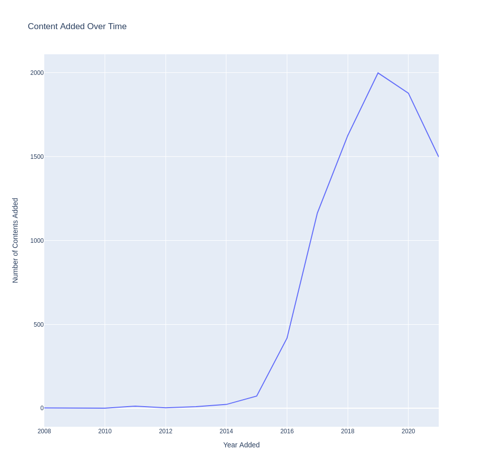

# Netflix Content Analysis

This is a simple data analysis project that will give a comprehensive analysis of the growth and type of content at netflix. (Dataset from mid 2021).

Using pandas and plotly

Data from https://www.kaggle.com/datasets/shivamb/netflix-shows

## Trend Analysis

This graph displays the amount of content added per year. Not to be mistaken for the amount of content on the platform per year.

There is a clear upward trend in the amount of content added to Netflix from 2008 to 2019. This indicates a period of aggressive expansion in terms of content acquisition and/or production.

The peak year is 2019, after which there is a noticeable dip. This could be due to various strategic, economic, or external factors influencing Netflix's content strategy.

After 2019, the decline could suggest a shift in strategy, possibly towards more original content that is typically more expensive and time-consuming to produce, or a market saturation where Netflix might be optimizing its content library based on viewership data.

## Genre Analysis

Top 10 most common genres and their changes

## Geographic Analysis

## Movie Duration Analysis

## Keyword Analysis