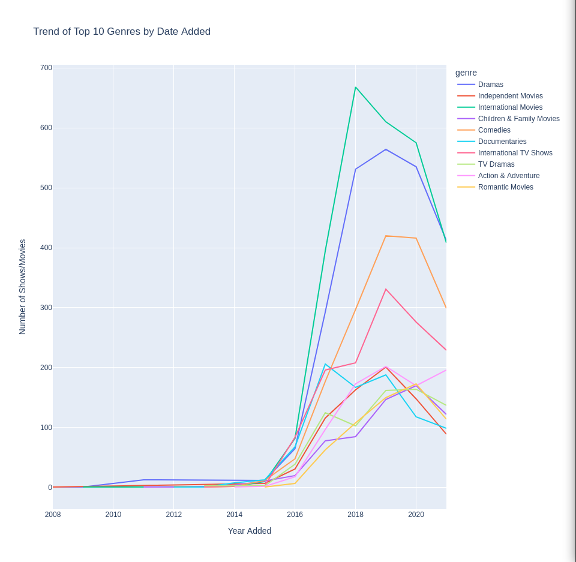
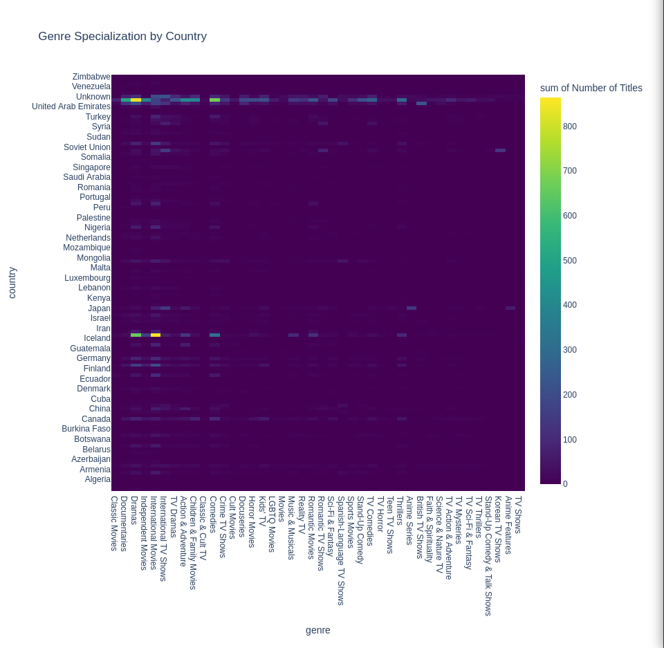
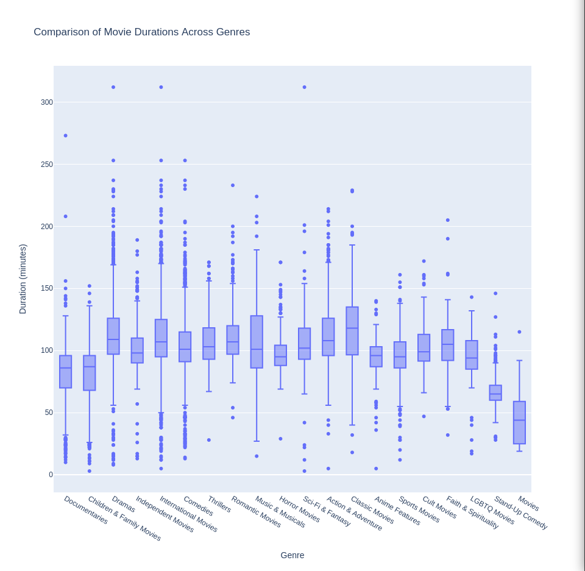

# Netflix Content Analysis

This is a simple data analysis project that will give a comprehensive analysis of the growth and type of content at netflix. (Dataset from mid 2021).

Using pandas and plotly

Data from https://www.kaggle.com/datasets/shivamb/netflix-shows

## Trend Analysis

This graph displays the amount of content added per year. Not to be mistaken for the amount of content on the platform per year.

There is a clear upward trend in the amount of content added to Netflix from 2008 to 2019. This indicates a period of aggressive expansion in terms of content acquisition and/or production.

The peak year is 2019, after which there is a noticeable dip. This could be due to various strategic, economic, or external factors influencing Netflix's content strategy.

After 2019, the decline could suggest a shift in strategy, possibly towards more original content that is typically more expensive and time-consuming to produce, or a market saturation where Netflix might be optimizing its content library based on viewership data.

## Genre Analysis

Top 10 Genres used only.

The genre "Dramas" experienced a sharp increase and peak around 2016-2017, with what looks like over 600 titles added, before declining sharply. This could be indicative of a focused push to expand this genre during those years, followed by a shift in strategy or saturation of the market.

Both "Independent Movies" and "International Movies" show a similar sharp rise and fall around the same period as "Dramas," suggesting there might have been a broader trend or strategy affecting multiple genres.

"International TV Shows" and "TV Dramas" show a sustained presence with a consistent upward trend, indicating a stable and growing interest in these categories.

"Comedies" and "Documentaries" have also seen growth, but more moderate compared to the peaks of "Dramas," "Independent Movies," and "International Movies." This could reflect a more steady demand for these genres.

The Children & Family Movies genre has seen a steady increase without any sharp spikes, which might suggest a consistent addition of content over the years.

Action & Adventure and Romantic Movies genres show a smaller presence on the graph compared to others, with a modest growth trend. This may indicate either a smaller market demand or less focus on these genres by the content platform.

Post the peak years, there is a noticeable decline across most genres, with some fluctuation. This could be due to market saturation, changes in licensing agreements, or shifts in content strategy.

## Geographic Analysis

Note that not all countries are visible with this type of graph layout. The interactive graph using plotly is better for data exploration

This heatmap uses color intensity to represent the number of titles produced in each genre by each country. Darker colors represent fewer titles, while brighter colors indicate a higher number of titles.

Some countries specialize in certain genres, indicated by bright colors in specific columns. For example, India shows a bright spot in the "Dramas" genre, suggesting a significant number of titles in this category compared to other countries and genres.

There are many countries with dark colors across all genres, which could mean the country's film industry is not as developed in those specific countries, or the country does not pursue deals with Netflix.

You can identify genres that are more universally produced, indicated by generally brighter rows. Genres like "Dramas" and "Independent Movies" seem to have a higher number of titles across multiple countries.

Some countries have bright spots in genres where most other countries do not, which could indicate a particular cultural or industry focus. For example, there may be a bright spot in a genre like "Anime Series" for Japan, which would reflect its strong cultural association with anime production.

The heatmap allows for the identification of general trends, such as which genres are more globally common, as well as outliers, such as countries with unexpected specializations.

The heatmap format can make it difficult to discern precise values or compare slight differences in shading. Thus, while it's good for observing broad trends and specializations, it's less effective for detailed analysis without numerical data or an interactive feature to explore the values.

## Movie Duration Analysis

Each genre has a wide range of movie durations, as indicated by the spread of dots (individual movie lengths) and the height of the boxes (which show the interquartile range).

The horizontal line within each box indicates the median duration of movies within that genre. Some genres have higher median durations than others, suggesting that certain types of movies tend to be longer or shorter on average.

The individual dots that are far away from the main cluster of dots within each genre represent outliers, which are movies that are exceptionally short or long compared to most movies in that genre.

Some genres have a greater variability in movie lengths, indicated by taller boxes and more outliers. For example, "Classic Movies" and "Music & Musicals" show a high degree of variability. In contrast, genres like "Children & Family Movies" seem to have less variability in duration.

"Movies" has shortest durations, while genres such as "Classic Movies" and "International Movies" tend to have longer durations. This suggests that "Movies" likely encompasses many short films, as its median duration is less than an hour.

Genres such as "Anime Features" and "Sports Movies" have a relatively consistent duration with fewer outliers, as indicated by the shorter boxes and fewer dots outside the interquartile range.

When comparing genres, "Classic Movies" tend to be longer than modern movie genres, which could reflect historical differences in movie-making styles or audience expectations.

Some genres show a skewed distribution of movie lengths. For instance, "Music & Musicals" have a right skew, indicating a cluster of longer-duration films within the genre.

The height of the boxes, which represents the interquartile range, can give an indication of the typical duration spread for 50% of the movies within each genre. A taller box suggests a wider range of "typical" movie lengths.

## Keyword Analysis

Top 10 Genres used only. 

Universal Themes: Words like "life," "young," "new," "family," and "love" are common across almost all genres. This indicates that universal themes revolving around life experiences, youth, family dynamics, and love stories are central to storytelling across cultures.

International Movies: Focus on personal identities and relationships is evident with words like "young," "man," "woman," "life," and "love." The presence of "must" and "one" could point to narratives about personal challenges and individual journeys.

Dramas: Emphasize personal and family issues, with "family," "father," and "finds" suggesting stories often revolve around familial relationships and personal discovery.

Comedies: Highlight social connections and situational humor, with "friends," "school," and "family" suggesting many plots based around social settings and the humor found in everyday life.

International TV Shows: Seem to mirror international movies, but with the addition of "series," indicating ongoing stories about personal and familial relationships.

Documentaries: The word "documentary" is the most common, followed by words like "life," "world," "history," and "interviews," indicating a focus on real-world issues, historical context, and personal narratives.

Action & Adventure: Words like "must," "mission," "take," and "group" suggest narratives often involve a quest or a collective effort in a high-stakes situation.

TV Dramas: Share similarities with the dramas genre, focusing on personal and family issues but in a serialized television format.

Independent Movies: Seem to focus on personal narratives, indicated by words like "young," "man," "woman," and "home," suggesting stories that are often more character-driven and intimate.

Children & Family Movies: Words like "save," "help," "friends," and "christmas" point to themes of adventure, camaraderie, and festive occasions, suitable for all ages.

Romantic Movies: Center around love and relationships, with "romance," "falls," and "relationship" pointing to the genre's focus on romantic entanglements and love stories.

Cultural Reflection: The prevalence of certain words in international genres may reflect cultural storytelling preferences or societal values that are prominent in those regions.

Narrative Devices:
The word "young" being common suggests that many stories are about or targeted towards a younger audience, possibly reflecting a universal appeal of coming-of-age stories.
Words like "man" and "woman" being prominent could indicate a strong focus on individual character-driven stories.
The term "two" often appears, which might imply a lot of stories revolve around dualities or relationships between two characters.

Storytelling Trends: The prominence of "life" and "new" across many genres could point to a trend in storytelling that focuses on new beginnings, life changes, and personal growth.